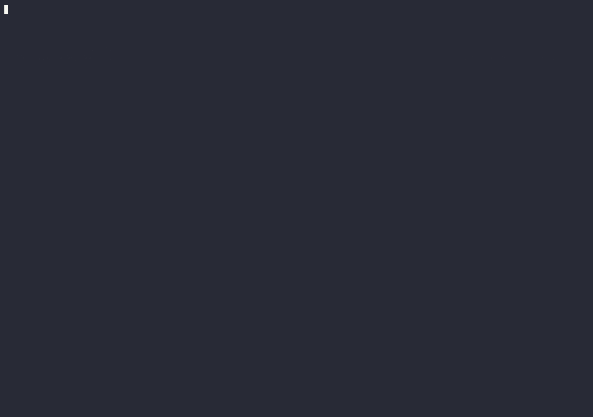

# pi-subtask

## Try this first

After installing, just ask Pi naturally: “Check auth and tests in parallel while I keep working.” Pi can call the subtask tool itself; /subtask remains the explicit manual command. There are no built-in personas or workflow engine.

A lightweight Pi subagent extension that runs non-blocking `/subtask` child sessions in parallel and inserts their final results back into the current session while the parent stays responsive.

[中文 README](README.md)

## Demo



## Install

```bash
pi install npm:pi-subtask
```

Try it for one session without installing it:

```bash
pi -e npm:pi-subtask
```

## Usage

```text
/subtask Inspect the authentication flow and report problems
```

Submit multiple `/subtask` commands to run children in parallel. The status bar lists active children line by line, up to five lines.

```text
/subtask
```

Run `/subtask` without a prompt to list active children.

## Language

Set `PI_SUBTASK_LOCALE` to `en-US` or `zh-CN`. The extension checks the process environment first, then reads `.env` from the current working directory.

```bash
cp .env.example .env
# English
PI_SUBTASK_LOCALE=en-US pi
```

Accepted aliases: `en`, `en-US`, `zh`, and `zh-CN`. Default: `zh-CN`.

## Behavior

- Each child has an independent Pi session file and session ID.
- Children run in parallel while the parent session remains responsive.
- Results are inserted through a FIFO queue to avoid concurrent-turn races.
- Active children remain in the status widget until their processes close.
- Child Pi processes cannot nest `/subtask`.
- Waiting tasks are instructed to use foreground synchronous `bash` commands.
- Child processes run with extensions disabled for a clean runtime.

## Security

Pi extensions run with the current user's full system permissions. Review source before installing third-party packages.

## Development

```bash
npm install
npm test
npx tsc --noEmit
```

The package uses Pi's built-in `@earendil-works/pi-coding-agent` as a peer dependency.
